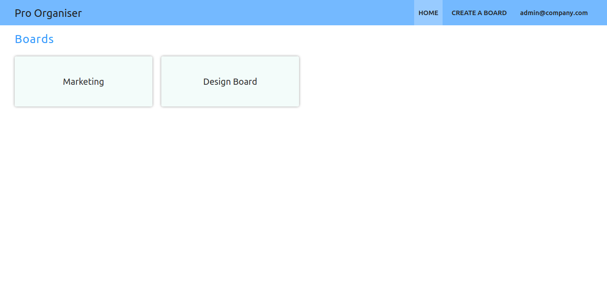
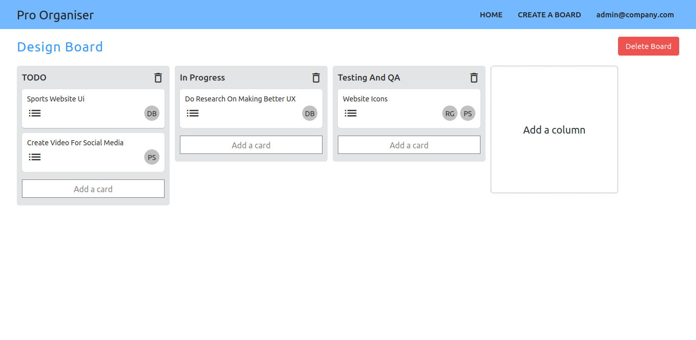

<h1 align="center"> Team Collaboration App(Pro-Organiser) </h1>

Trello like collaboration Web APP made using React, React Hooks, Context API, and using Firebase as a Database.

## [Live Preview](https://pro-organisers.web.app)

## Screens

Home Page



Board Page



## Getting Started

Clone the repository, and inside the project directory run

`npm install`

This will install all the required dependencies for the project.

### Sample Environment File

Create a `.env` file in the root directory of the project.

```sh
REACT_APP_APIKEY=yourapikey
REACT_APP_messagingSenderId=yourmesseginsenderid
REACT_APP_appId=yourappid
REACT_APP_measurementId=yourmeasurementid
REACT_APP_DBURL=yourdburl
REACT_APP_storageBucket=storagebucket
REACT_APP_authDomain=yourauthdomain
REACT_APP_projectId=yourprojectid
```

Inside the project directory you can then run

`npm start`

which will then run the project on developement mode. Open [http://localhost:3000](http://localhost:3000) to view it a Browser.

## Author

👤 **Shubham Battoo**

- Twitter: [@Shubham_batt](https://twitter.com/Shubham_batt)
- Github: [@shubhambattoo](https://github.com/shubhambattoo)

## Contributing

Contributions, issues and feature requests are welcome!<br />Feel free to check [issues page](https://github.com/shubhambattoo/noti-fly/issues).

## License

Copyright © 2020 [shubhambattoo](https://github.com/shubhambattoo).<br />
This project is [MIT](https://github.com/shubhambattoo/pro-organiser-application/blob/master/LICENSE) licensed.

Give a ⭐️ if this project helped you!
